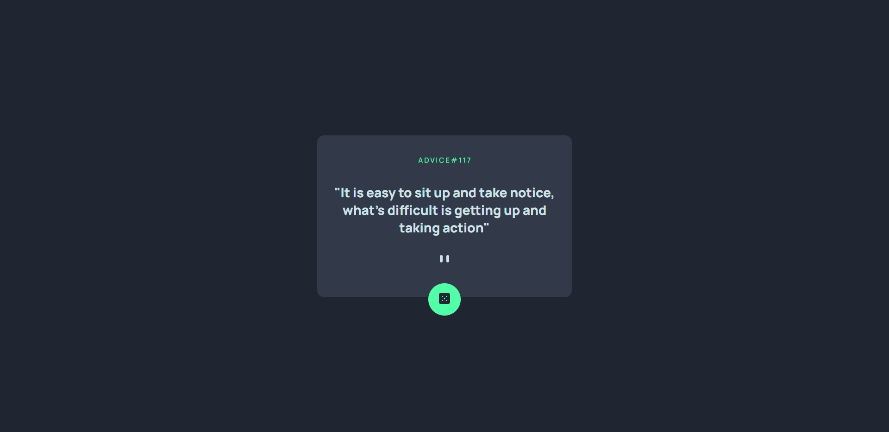

# Projeto Advice Generator
Um projeto feito no Frontend que apresenta um gerador de conselhos responsivo utilizando HTML, CSS e Javascript. Foi utilizada a API "Advice Slip" para fazer a mudança do texto ao apertar o botão.

Link da API: https://api.adviceslip.com/

 

## Tecnologias utilizadas
- HTML
- CSS
- JS